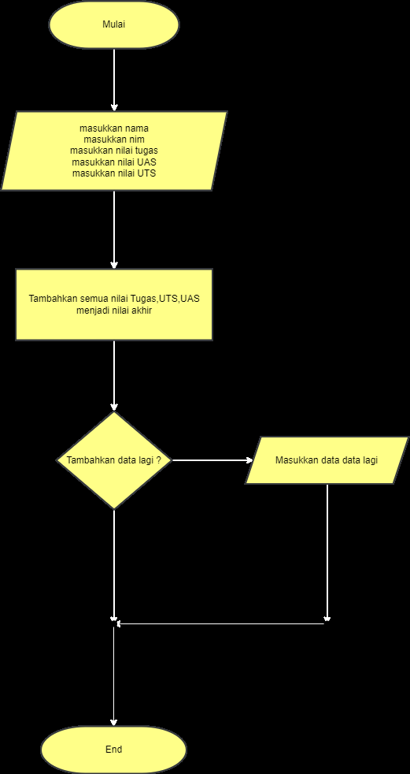
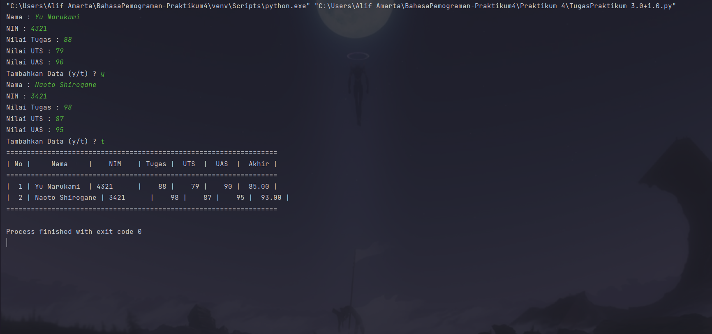

Nama : Alif Nur Fathlii Amarta

NIM : 312210326

Kelas: TI.22.A3

# Praktikum 4
## Latihan 1

_List_ merupakan sebuah jenis data yang berisikan elemen elemen bisa berupa _string_,_Bool_,_integer_ 

contoh list berupa 

    kota = ['Ngawi','Jakarta','Madiun','Bandung','Nganjuk']

untuk menampilkan elemennya kita bisa menggunakan

    print(kota)

jika ingin menampilkan elemen tertentu 

    print(kota[2])

maka akan menampilkan 


jika ingin menampilkan 3 elemen secara bersamaan gunakan

    print(kota[1:4])

maka akan menampilkan


jika ingin menggantikan sebuah elemen 

    kota[3] = 'Tulungagung'

maka akan menggantikan elemen yang keempat 

jika ingin menggantikan elemen secara bersamaan

    kota[3:4] = 'Cilacap','Batam'

maka akan menggantikan elemen keempat hingga terakhir


kita juga bisa mengambilkan list dari list lain dengan cara

    kota1 = [kota[0],kota[1]]

maka List nya akan berisi kan list pertama tadi

list bisa ditambahkan dengan ```append()``` 

    kota1.append('Pekalongan')

maka akan tambah elemen baru 


List bisa ditambahkan elemen lebih banyak dengan ```extend()```

    kota1.extend(['Surakarta','Karawang','Cirebon'])

maka akan bertambah 3 elemen


elemen dalam list bisa ditambahkan dengan operasional pertambahan ```(+)```

    kota3 = kota1 + kota

maka output nya


---

## Tugas Praktikum 

Flowchart 




Gunakan _While_ untuk memasukkan data secara berulang berulang dan masukkan ```input()```

```
data = []
stop = False

while(not stop):
    nama = input("Nama : ")
    nim = input("NIM : ")
    tugas = int(input("Nilai Tugas : "))
    uts = int(input("Nilai UTS : "))
    uas = int(input("Nilai UAS : "))
    akhir = (tugas * 30/100) + (uts * 35/100) + (uas * 35/100)
```

Gunakan ```.append()``` untuk menambahkan elemen ke list

    data.append([nama,nim,tugas,uts,uas,int(akhir)])

Untuk menetapkan 't' menjadi stop gunakan 

```
tanya = input('Tambahkan Data (y/t) ?')
    if (tanya == 't'):
        stop = True
```

lalu tampilkan elemen elemennya
    
```
print("==================================================================")
print("| No |     Nama     |    NIM    | Tugas |  UTS  |  UAS  |  Akhir |")
print("==================================================================")

i = 0

for nilai in data:
    i += 1
    print("| {no:2d} | {nama:12s} | {nim:9s} | {tugas:5d} | {uts:5d} | {uas:5d} | {akhir:6.2f} |".format(no=i, nama=nilai[0], nim=nilai[1], tugas=nilai[2],uts=nilai[3],uas=nilai[4],akhir=nilai[5]))

print("==================================================================") 
```

maka hasilnya akan menjadi 

